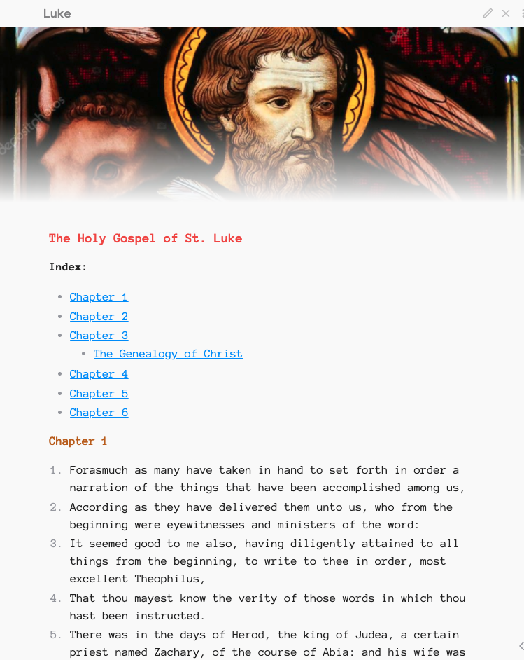

# Markdown Bible

## Purpose

The purpose of this repo is to provide people with a plain-text version of the Holy Bible.

## Editor

There is metadata in the raw file. This tag *^4-1* is for linking the verse and chapter using Obsidian.

### Misc

The translation is the Douey-Rheims. I did not remove or add anything to the verses. Simply turned them
into readable Markdown.

### Screenshots

